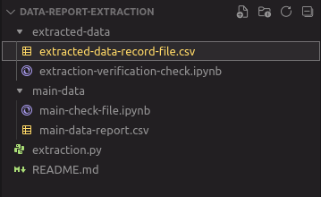

# Python Data Extraction With CSV Library

<h2> Description: </h2> 
A dedicated functional one line program code written in Python that extracts a specific data-records from a data and generates a new file

 

This project aims to the reduce streneous manual time spent on extracting specific records from a data file **(in csv format)**. The program code does the following:

* imports the **`csv`** library
* locates the data from your specified relative path
* automatically reads the data file and extracts the targeted records from the data

-------

## IMAGE ILLUSTRATION

**STEP 1:** Making sure your directories are properly structured

**STEP 2:** Successful execution of the code

**STEP 3:** New extracted file generated

